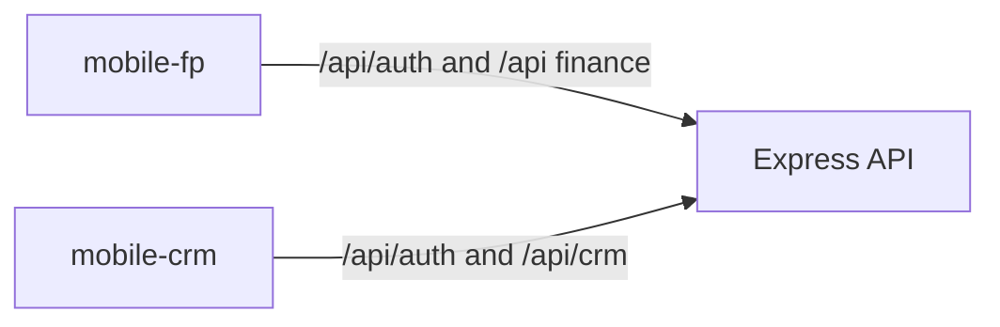

# Rename CRM mobile and add Freedom Planner mobile

## Rename `apps/mobile` to `apps/mobile-crm`

Move the existing app in place. It stays on port **8085** and `mobile.local.uat`. Package name becomes `mobile-crm`. Session keys become `mobile-crm-access-token`, `mobile-crm-refresh-token`, and `mobile-crm-user` so it can sit on the same host as the finance app.

Update every reference that still says `apps/mobile` or filter `mobile`:

- Dockerfiles that `COPY apps/mobile/package.json` (api has two stages, plus web, website, crm, and the mobile Dockerfiles themselves). The copy path becomes `apps/mobile-crm/package.json`, and each file also gains `apps/mobile-fp/package.json`, because `pnpm install --frozen-lockfile` checks every workspace.
- [docker-compose.dev.yml](docker-compose.dev.yml) and [docker-compose.prod.yml](docker-compose.prod.yml), [containers/nginx/nginx.dev.conf](containers/nginx/nginx.dev.conf), [containers/nginx/nginx.prod.conf](containers/nginx/nginx.prod.conf)
- [CLAUDE.md](CLAUDE.md), [README.md](README.md), [docs/PROJECT_SPEC.md](docs/PROJECT_SPEC.md), [docs/DEVELOPMENT_PLAN.md](docs/DEVELOPMENT_PLAN.md), [.env.example](.env.example)

No API, Prisma, or envelope changes.

## New app `apps/mobile-fp`

Copy the CRM mobile shell, not the CRM data. Same phone layout already in use: sticky header (menu, title, green plus, hollow green profile ring), one `max-w-md` column, safe-area insets, search on every bottom tab, card lists with Load more, create sheets, green tokens, PWA.

- Port **8086**, host `fp.local.uat`
- Package name `mobile-fp`
- Session keys `fp-access-token` / `fp-refresh-token` / `fp-user`
- Auth is the finance login (password + OTP), `requireAuth` only. No CRM permissions.
- Apps still do not import each other. Finance types and API calls are a trimmed copy of [apps/web/src/lib/finance/remote.ts](apps/web/src/lib/finance/remote.ts) into `apps/mobile-fp/src/lib/finance/remote.ts`.

## What sits where

Bottom tabs, same five-slot bar as CRM mobile:

- **Home** — `GET /api/planner/report` tiles (net worth and the headline numbers), plus what is due soon
- **Income** and **Expenses** — `/api/budgets`, search, add and edit sheets
- **Loans** — `/api/loans`
- **Goals** — `/api/goals`

Profile stays in the header corner. The plus sheet offers Income, Expense, Loan, Goal, and Investment, and opens the matching screen with `?new=1`, the same create-intent pattern as CRM mobile.

Side menu, each a real phone screen (search or a short form, not the desktop module):

- Investments (`/api/investments`), Insurance (`/api/insurances`), Quick setup (`/api/financial-profile` and `/api/setup/complete`)
- AI Advisor (`/api/advisor/report`), AI Chat (`/api/advisor/chat`), Statement analyzer (`/api/statements`)
- Tax (`/api/tax`), Freedom and the other calculators (`/api/calculators/preview` on one screen with a type picker)
- Summary report from the planner report
- Course and Learning Hub as the same static content the web app already ships, laid out as a single column

Credit cards and the budget tracker have no API today. The web app keeps them in localStorage extras. The phone app will do the same under an `fp-` key, and will not copy income, loans, goals, or insurance into localStorage.

## Out of scope

No new finance endpoints, no Prisma changes, and no shared package between the two phone apps. Desktop charts, amortization dialogs, and the full report PDF stay on `apps/web`.
